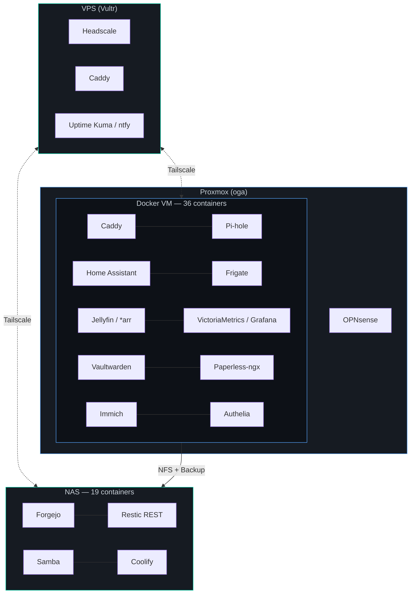

# Homelab

> 68 services · 3 hosts · 1 person · Paraguay 🇵🇾

A self-hosted infrastructure running Docker, Ansible, and OPNsense across a Docker VM, NAS, and VPS — connected by a Tailscale mesh over cronova.dev. Every service is named in [Guarani](reference/guarani-naming-convention-2026-02-24.md), the indigenous language of Paraguay.

## What's Here

📝 **[Blog](/blog/)** — Incident deep dives, backup war stories, and lessons from running production infra as a solo operator.

📐 **[Architecture](architecture/fixed-homelab.md)** — What runs where. [68 services](architecture/services.md), [network topology](architecture/network-topology.md), [hardware specs](architecture/hardware.md).

📖 **[Guides](guides/setup-runbook.md)** — How to deploy it. [Proxmox](guides/proxmox-setup.md), [OPNsense](guides/opnsense-setup.md), [NAS](guides/nas-guide.md), [Caddy](guides/caddy-config.md), [backups](guides/backup-test-procedure.md).

🛡️ **[Strategy](strategy/dns-architecture.md)** — Why it's built this way. [DNS](strategy/dns-architecture.md), [security hardening](strategy/security-hardening.md), [disaster recovery](strategy/disaster-recovery.md), [monitoring](strategy/monitoring-strategy.md).

📋 **[Plans](plans/rpi5-deployment-plan.md)** — What's next. [RPi 5 + OpenClaw](plans/rpi5-deployment-plan.md), [CrowdSec](plans/crowdsec-opnsense-2026-03-11.md), [VPN for torrents](plans/arr-stack-hardening-2026-03-24.md).

🔥 **[Incidents](guides/incident-2026-03-18-wan-nat-outage.md)** — What broke and how I fixed it. [ISP outages](guides/incident-2026-03-05-isp-outage.md), [NAT failures](guides/incident-2026-03-18-wan-nat-outage.md), [power outages](guides/incident-2026-03-24-power-outage.md).

## Highlights

- **Container hardening** — `cap_drop: ALL` + selective `cap_add` on every single container
- **Backup verification** — [automated restore drills](https://github.com/ajhermosilla/homelab/blob/main/scripts/backup-verify.sh) that actually test recovery, not just snapshot existence
- **4 incident reports** with real timelines, root cause analysis, and cascading failure diagrams
- **WAN watchdog** — auto-recovers OPNsense after ISP outages, including silent NAT failures
- **Recursive DNS** — AdGuard + Unbound on VPS, Pi-hole on Docker VM. Zero third-party DNS visibility
- **Forgejo Actions CI** — lint + build gates PR merges. Can't merge broken code to main

## About

This is a personal infrastructure repo, not a deployable template. Feel free to browse, borrow ideas, and adapt patterns to your own setup.

Built by [Augusto Hermosilla](https://github.com/ajhermosilla) from Asunción, Paraguay. Code is public at [github.com/ajhermosilla/homelab](https://github.com/ajhermosilla/homelab).
